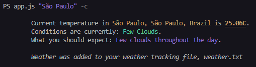

# soloproject-tier3-chinguweather

> Simple Node.js CLI tool to fetch weather data based on a location string, also saves the data on a .txt file.


## Install
Clone this repository and run
```sh
npm install
```
Then create a .env file with your Mapbox and OpenWeather API keys
```sh
MAPBOX_TOKEN="YOUR_TOKEN"
OPENWEATHER_KEY="YOUR_KEY"
```

## Usage

```
node app.js "location" -unit
```
Location is required
Unit can be -c or -f, if empty both units are displayed

## Related

- [soloproject-tier3-chinguweather](https://github.com/chingu-voyages/soloproject-tier3-chinguweather) - Chingu Tier 3 Weather CLI Project
